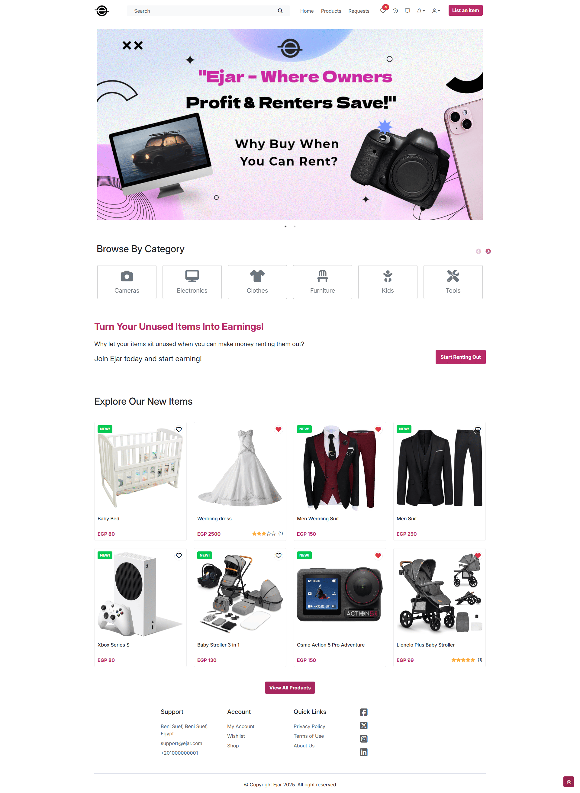
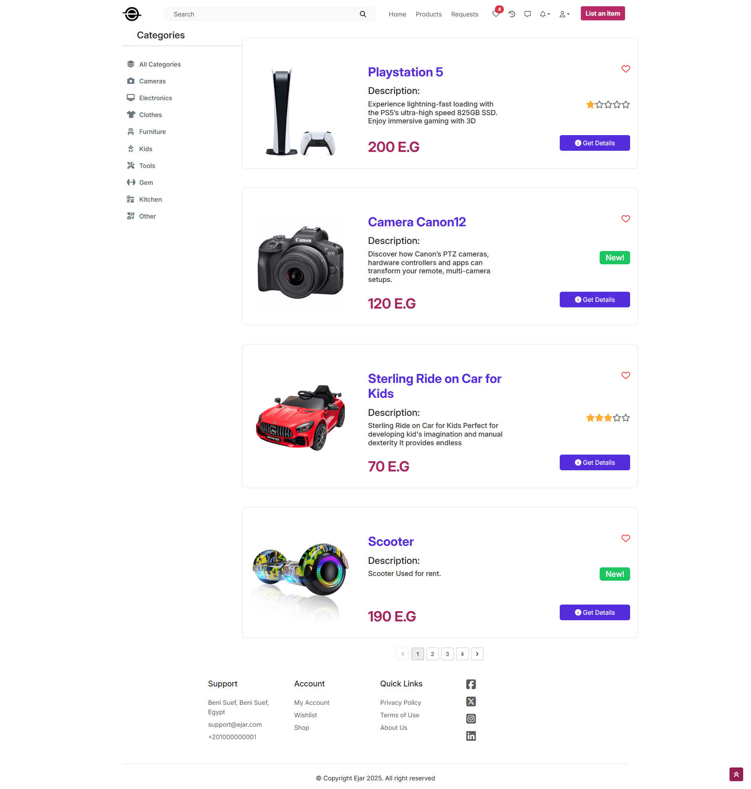
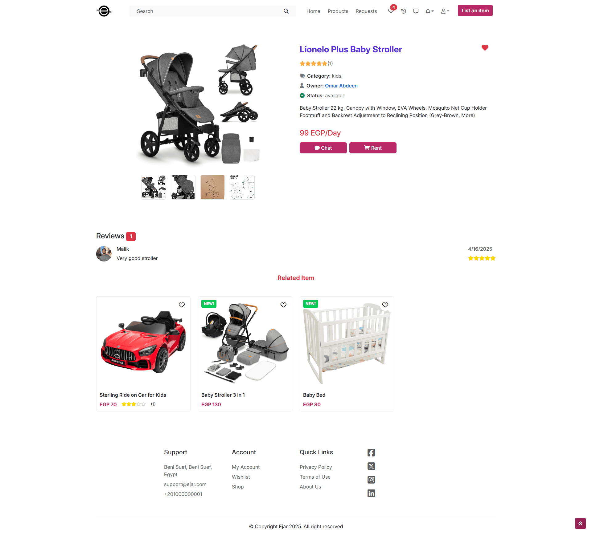
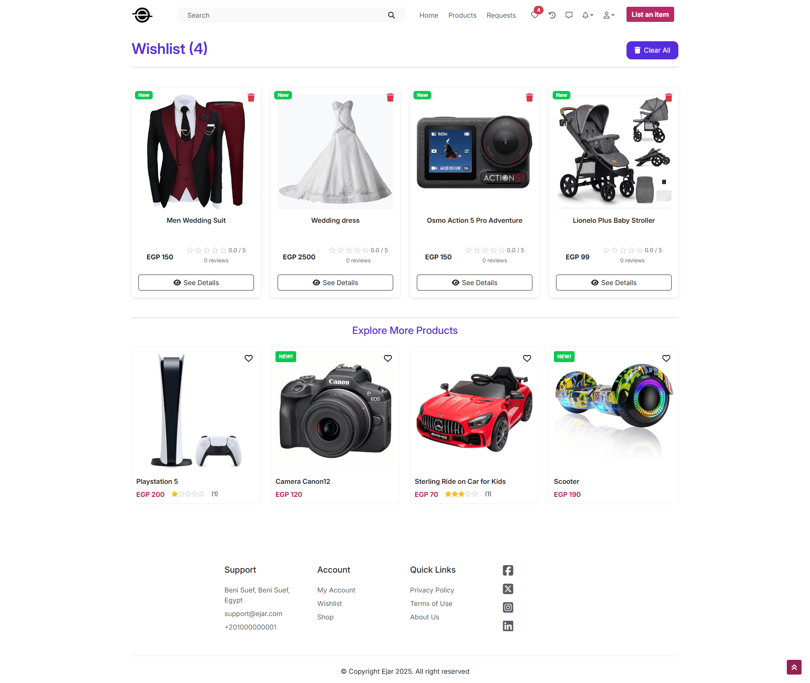
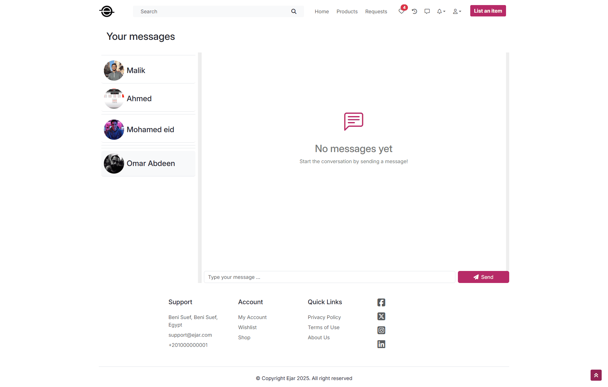

# 🏠 Ejar Rental Platform App – (React)

This is the customer-facing frontend for **Ejar Rental Platform**, a modern rental platform where users can rent out their belongings or borrow items from others.

This application is built using **React 19** and powered by **Vite**, with full integration to a Node.js backend and Angular-based admin dashboard.

It was developed as part of the **ITI Graduation Project (2025)** during the **ITI ICC Training**.

---

## 🔄 Project Origin

This repository is a clean version extracted from the original team repository that contains the full commit history of the collaboration.

👉 [Original Team Repository](https://github.com/malikhussein/ITI-react-ejar-project)

---

## 📸 Screenshots

  
  
  
  
  

---

## 🧠 Key Features

- 🛒 Browse and search items available for rent
- 📆 Select rental period using calendar date pickers
- 🔐 Secure authentication with JWT
- 📱 Responsive design using MUI and Bootstrap
- 💬 Real-time chat powered by `socket.io-client`
- 🎯 Form validation using Formik + Yup
- 🧠 Global state managed via Zustand
- 🍞 Toast notifications with `react-toastify`
- 🖼 Image magnifier, sliders, and slick carousels

---

## 🛠️ Tech Stack

- **React 19** + **Vite 6**
- **React Router v7**
- **Material UI (MUI)** + **Bootstrap 5**
- **Zustand** for state management
- **Formik** + **Yup** for forms and validation
- **Socket.IO Client** for real-time communication
- **React Toastify**, **React Spinners**, **Slick Carousel**

> See `package.json` for full list of dependencies.

---

## 👥 Our Team

| Name          | GitHub Profile                                         |
| ------------- | ------------------------------------------------------ |
| Mohamed Ahmed | [@MohamedAhIsmail](https://github.com/MohamedAhIsmail) |
| Malik Hussein | [@malikhussein](https://github.com/malikhussein)       |
| Ahmed Amr     | [@ahmedamr3000](https://github.com/ahmedamr3000)       |
| Mohamed Eid   | [@Mohamedeid602](https://github.com/Mohamedeid602)     |
| Omar Abdeen   | [@OmarAbdeen](https://github.com/Test0-VC)             |

---

## 🔗 Part of a Rental Platform Project

This customer website is part of a larger product called **Ejar Rental Platform**, which includes:

- 🧑‍💼 **Admin Dashboard** → Angular
- 🔧 **Backend API** → Node.js & Express RESTful API powering the entire platform


👉 [View the Full Project Repository](https://github.com/MohamedAhIsmail/ejar-rental-platform)

---

## ⚙️ How to Run Locally

```bash
# Clone the repository
git clone https://github.com/MohamedAhIsmail/ejar-rental-platform-react.git

# Navigate into the project
cd ejar-rental-platform-react

# Install dependencies
npm install

# Run the app locally
npm run dev

